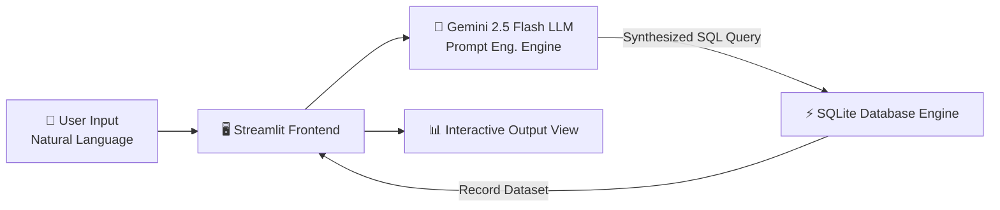

# 🤖 RetrieveGPT — Natural Language to SQL Query Engine

[](https://www.python.org/)
[](https://streamlit.io/)
[](https://ai.google.dev/)
[](https://www.sqlite.org/)
[](LICENSE)

**RetrieveGPT** is an intelligent Generative AI-driven database query agent that translates plain English natural language questions into syntactically precise SQL queries using **Google Gemini 2.5 Flash**, executes them seamlessly against an **SQLite** database, and displays structured real-time results through an intuitive **Streamlit** dashboard.

---

## 🌟 Key Features

- 💬 **Natural Language Querying**: Ask questions in plain English without writing a single line of SQL.
- ⚡ **Powered by Gemini 2.5 Flash**: Delivers lightning-fast zero-shot SQL query generation with high precision.
- 🛡️ **Automated Query Sanitization**: Custom system prompt rules prevent markdown formatting artifacts (e.g., backticks, `sql` tags) for direct executable SQL output.
- 📊 **Real-time Database Execution**: Connects dynamically to SQLite to fetch, parse, and render table records instantly.
- 🎨 **Minimalist Streamlit UI**: Clean, interactive Web UI designed for non-technical users and data analysts alike.

---

## 🏗️ System Architecture



---

## 🚀 Quick Start Guide

### Prerequisites

- Python 3.9+ installed
- Google Gemini API Key ([Get your API Key here](https://aistudio.google.com/))

### 1. Clone the Repository
```bash
git clone https://github.com/your-username/retrieve-GPT.git
cd retrieve-GPT
```

### 2. Install Dependencies
```bash
pip install -r requirements.txt
```

### 3. Configure Environment Variables
Create a `.env` file in the root directory and add your Google Gemini API key:
```env
GOOGLE_API_KEY=your_gemini_api_key_here
```

### 4. Initialize the SQLite Database
Seed the local `Student.db` with sample records:
```bash
python sqlite.py
```

### 5. Run the Streamlit Application
```bash
streamlit run app.py
```

---

## 📸 Screenshots & Showcase

| Database Overview | Natural Language Query Example | Output Results |
| :---: | :---: | :---: |
|  |  |  |

---

## 🛠️ Project Structure

```
retrieve-GPT/
├── app.py              # Main Streamlit web application & LLM orchestration
├── sqlite.py           # Database setup script & sample data seeding
├── requirements.txt    # Python package dependencies
├── README.md           # Project documentation
├── .env                # Environment configuration (API keys)
└── LICENSE             # MIT License
```

---

## 🤝 Contributing

Contributions, issues, and feature requests are welcome! Feel free to check the [issues page](https://github.com/your-username/retrieve-GPT/issues).

---

## 📜 License

Distributed under the MIT License. See `LICENSE` for more information.
